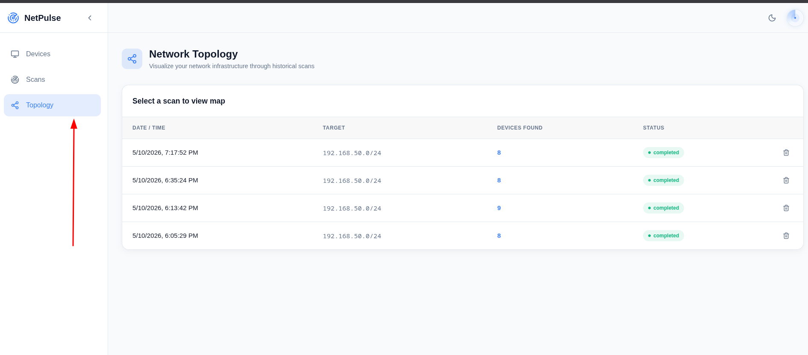
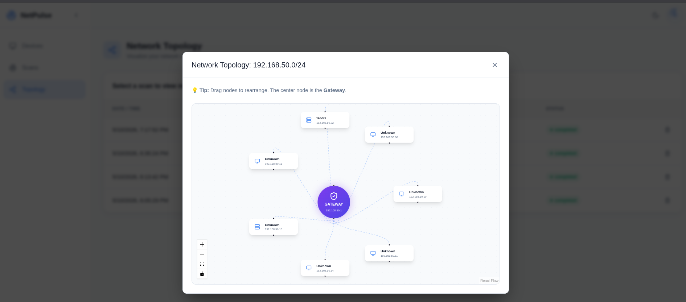

# 📡 NetPulse Audit Stack
> **Plataforma Full-Stack de Auditoría de Red y Ciberseguridad Defensiva.**

NetPulse es una solución profesional diseñada para la visibilidad total de infraestructuras de red locales. Utiliza una arquitectura de microservicios contenerizada para ofrecer escaneo táctico de puertos, descubrimiento de dispositivos en tiempo real y análisis de topología interactivo.

---

## 🚀 Funcionalidades Destacadas

### 🛡️ Rogue Device Detection
NetPulse ahora incluye inteligencia comparativa. El sistema detecta automáticamente si un dispositivo es nuevo en la red comparándolo con escaneos históricos, resaltando posibles intrusos con alertas visuales dinámicas tanto en la tabla como en el mapa de topología.

### 🕸️ Mapa de Topología Interactivo
Visualización de nodos basada en **ReactFlow**. Permite ver el Gateway y los dispositivos orbitando con conexiones animadas, permitiendo una comprensión inmediata de la jerarquía de la infraestructura.

### ⚡ Streaming de Datos con SSE
Descubrimiento de red ultra-rápido mediante **Server-Sent Events (SSE)**. Los dispositivos y sus puertos abiertos aparecen en el dashboard al instante conforme son detectados por el motor táctico.

### 🌓 Diseño Premium & UX
Interfaz moderna y responsiva con soporte nativo para **Dark/Light Mode**, diseñada para maximizar la legibilidad de datos técnicos complejos.

---

## 📸 Vista Previa del Sistema

### Network Topology — Interactive Map
> Visualiza la infraestructura de red de forma gráfica. Arrastra nodos, haz zoom y analiza las conexiones entre el Gateway y los dispositivos detectados.



### Rogue Device Alerts — Security Focus
> Identifica instantáneamente cambios en la red. Los nuevos dispositivos se resaltan en rojo con alertas visuales animadas.



---

## 🏗️ Arquitectura Técnica

NetPulse se divide en cuatro servicios core totalmente aislados y orquestados mediante **Docker Compose**:

1.  **Scanner API (Python 3.11 / FastAPI):**
    *   Motor táctico basado en `Nmap` y `Scapy`.
    *   Ejecución asíncrona (`asyncio`) para escaneos paralelos de alto rendimiento.
    *   Streaming de eventos en tiempo real.
2.  **Core Backend (Next.js 16+ / App Router):**
    *   Orquestador de APIs y persistencia relacional.
    *   Lógica de comparación histórica para detección de intrusos.
    *   Consultas SQL optimizadas mediante `pg`.
3.  **Real-Time Frontend (React / Vite):**
    *   Dashboard reactivo construido con **Tailwind CSS v4**.
    *   Visualización de grafos avanzada con `ReactFlow`.
    *   Gestión de estado global mediante Context API.
4.  **Database (PostgreSQL):**
    *   Almacenamiento persistente de dispositivos, puertos y trazas históricas.

---

## 🧪 Calidad de Software y CI/CD

El proyecto mantiene un estándar de calidad riguroso mediante una pipeline de **Integración Continua (CI)** local:

*   **Scanner:** 31 tests unitarios (Pytest) + Validación de estilo (Flake8).
*   **Backend:** 34 tests unitarios (Vitest) + TypeScript Check + ESLint.
*   **Frontend:** 34 tests unitarios (Vitest) + TypeScript Check + ESLint.

Para validar el estado de todo el proyecto, simplemente ejecuta:
```bash
make ci
```

---

## 🚦 Guía de Instalación Rápida

### Prerrequisitos
- Docker & Docker Compose
- Makefile

### Lanzamiento
1. Clonar el repositorio:
   ```bash
   git clone https://github.com/JoseAndres20/NetPulse.git
   cd NetPulse
   ```
2. Configurar variables de entorno:
   ```bash
   cp .env.example .env
   ```
3. Levantar el stack:
   ```bash
   make up
   ```
4. Acceder al dashboard:
   - Frontend: [http://localhost](http://localhost)
   - API Docs: [http://localhost:8000/docs](http://localhost:8000/docs)

---

## 🛡️ Licencia
Distribuido bajo la Licencia MIT. Ver `LICENSE` para más información.
