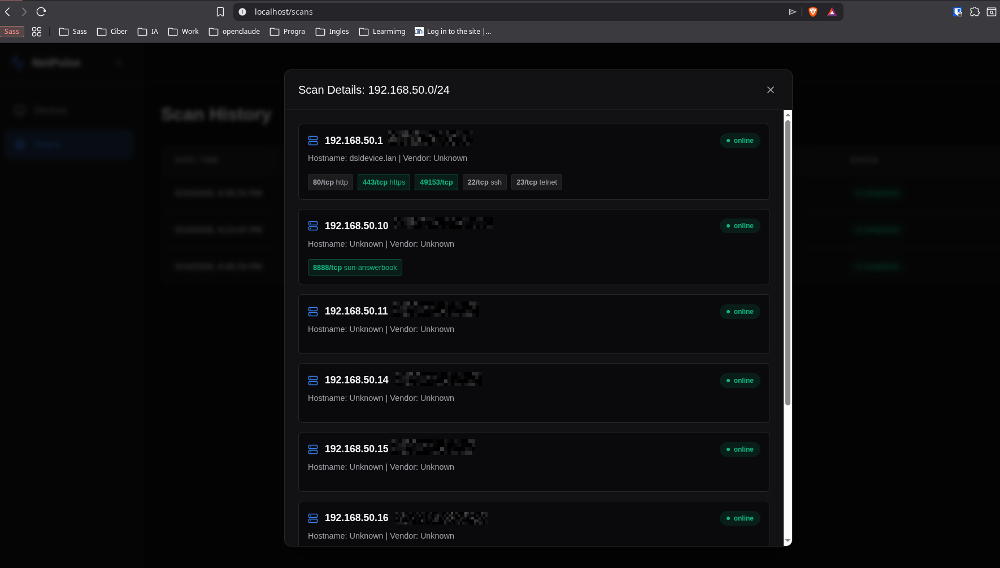

# 📡 NetPulse Audit Stack
> **Plataforma Full-Stack de Auditoría de Red y Ciberseguridad Defensiva.**

NetPulse es una solución profesional diseñada para la visibilidad total de infraestructuras de red locales. Utiliza una arquitectura de microservicios contenerizada para ofrecer escaneo táctico de puertos, descubrimiento de dispositivos en tiempo real y análisis de topología interactivo con detección de intrusos.

---

## 🏗️ Arquitectura del Sistema
El proyecto está construido sobre una infraestructura robusta de microservicios, diseñada para escalabilidad y aislamiento.

<p align="center">
  
</p>

---

## 📸 Galería de Funcionalidades

### 🕸️ 1. Topología de Red Dinámica
Visualización interactiva basada en **ReactFlow**. Permite identificar jerarquías y conexiones entre el Gateway y los dispositivos detectados de forma gráfica.

<p align="center">
  
</p>

### 🛡️ 2. Detección de Rogue Devices
Inteligencia de red que compara escaneos históricos para detectar automáticamente nuevos dispositivos, alertando visualmente sobre posibles intrusos.

<p align="center">
  
</p>

### 📊 3. Gestión de Dispositivos y Servicios
Análisis detallado de puertos abiertos, servicios y fingerprinting de dispositivos (S.O., Fabricante, etc.).

<p align="center">
  
</p>

### 📜 4. Historial de Auditoría
Control total sobre los escaneos realizados, permitiendo volver atrás en el tiempo para comparar el estado de la red.

<p align="center">
  
</p>

### 🌓 5. Interfaz Premium (Dark/Light Mode)
Diseño moderno y adaptable que garantiza la mejor experiencia de usuario en cualquier entorno de trabajo.

<p align="center">
  
</p>

### ✨ 6. Características Core
Resumen de las capacidades tácticas del motor de escaneo.

<p align="center">
  
</p>

---

## 🧪 Calidad de Software y CI/CD

El proyecto cuenta con una pipeline de **Integración Continua (CI)** local que valida cada commit:

*   **Scanner:** 31 tests unitarios (Pytest) + Validación de estilo (Flake8).
*   **Backend:** 34 tests unitarios (Vitest) + TypeScript Check + ESLint.
*   **Frontend:** 34 tests unitarios (Vitest) + TypeScript Check + ESLint.

Para validar el stack completo:
```bash
make ci
```

---

## 🚦 Guía de Inicio Rápido

1. **Clonar:** `git clone https://github.com/JoseAndres20/NetPulse.git`
2. **Configurar:** `cp .env.example .env`
3. **Levantar:** `make up`

---

## 🛡️ Licencia
Distribuido bajo la Licencia MIT. Ver `LICENSE` para más información.
