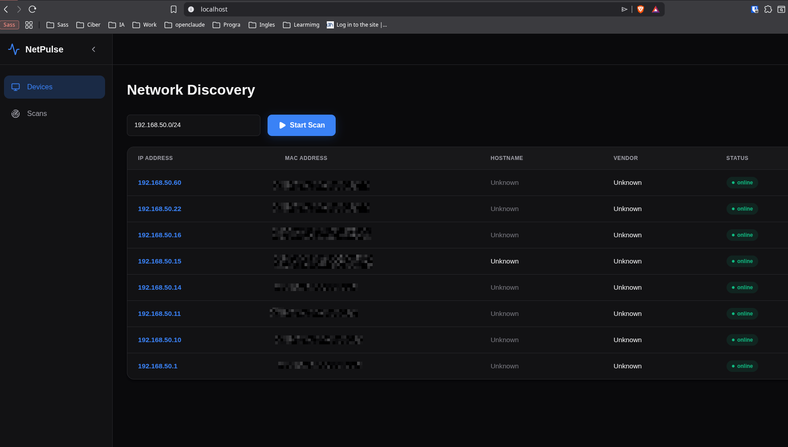
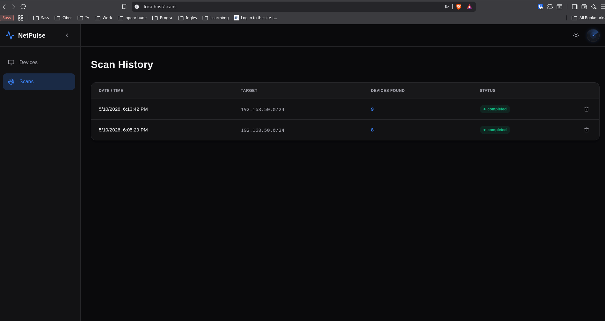
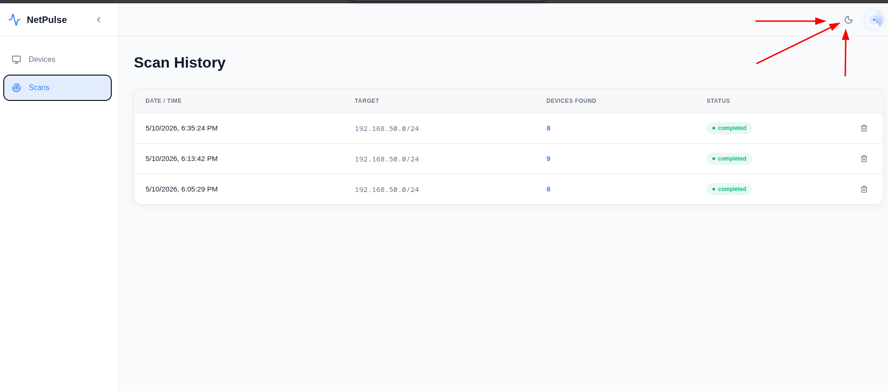
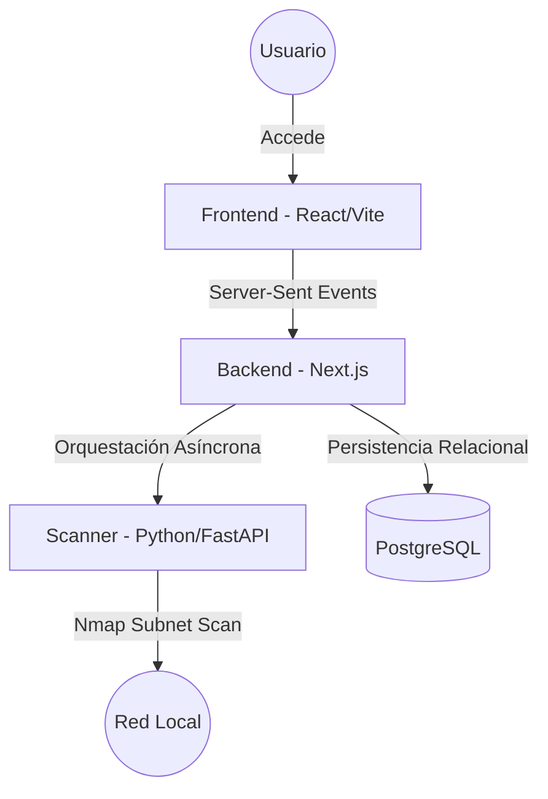

# 📡 NetPulse Audit Stack

**NetPulse Audit Stack** es una plataforma profesional de monitoreo y descubrimiento de redes locales en tiempo real. Diseñada bajo una arquitectura de microservicios contenida en Docker, permite identificar dispositivos, auditar puertos y visualizar el estado de la red de forma eficiente y segura.

## 📸 Preview

### Network Discovery — Dark Mode
> Escanea rangos de red en tiempo real. Los dispositivos aparecen al instante conforme son detectados.



### Scan History — Dark Mode
> Historial completo de escaneos con dispositivos encontrados, timestamps y estado.



### Scan History — Light Mode
> Interfaz adaptable con soporte de tema claro para entornos de trabajo diurnos.



---

## 🏗️ Arquitectura del Sistema

El proyecto se divide en 4 contenedores especializados que colaboran entre sí:



### Componentes:
1.  **Scanner (Python/FastAPI):** El motor táctico. Utiliza `Nmap` con ejecución asíncrona (`asyncio`) y privilegios de red (`host mode`) para el descubrimiento profundo de dispositivos y puertos en toda la subred. Mantiene la conexión viva mediante Server-Sent Events (SSE).
2.  **Backend (Next.js 16+):** El orquestador de APIs. Gestiona la lógica de negocio, las rutas de red y las consultas de alto rendimiento a la base de datos usando SQL puro mediante el driver `pg`.
3.  **Frontend (React/Vite):** El dashboard visual. Una interfaz moderna y reactiva que utiliza Context API (`ScanContext`) para mantener los escaneos en segundo plano de manera global en toda la app.
4.  **Database (PostgreSQL):** Almacenamiento persistente relacional de dispositivos, puertos, y la traza histórica exacta de escaneos a través de tablas intermedias (`scan_devices`).

---

## 🛠️ Stack Tecnológico

| Componente | Tecnología |
| :--- | :--- |
| **Scanner** | Docker, Python 3.11, FastAPI, Nmap, asyncio |
| **Backend** | Docker, Node.js, Next.js (App Router API), TypeScript, pg (node-postgres) |
| **Frontend** | Docker, React 19, Vite, Tailwind CSS v4, Lucide React, Context API |
| **Infraestructura** | Docker Compose, Makefile, CI/CD Local (`make ci`) |
| **Base de Datos** | Docker, PostgreSQL 15 (Alpine) |

---

## 🚀 Inicio Rápido

Este proyecto está optimizado para ejecutarse con un solo comando gracias al `Makefile` incluido.

### Requisitos:
*   Docker y Docker Compose instalados.
*   Linux (recomendado para el modo `host` del scanner).

### Instalación:

1.  **Clona el repositorio:**
    ```bash
    git clone https://github.com/tu-usuario/netpulse-audit.git
    cd netpulse-audit
    ```

2.  **Levanta el stack completo:**
    ```bash
    make restart
    ```

3.  **Verifica los servicios:**
    ```bash
    make urls
    ```

---

## 📖 Comandos Disponibles (Makefile)

*   `make up`: Inicia los contenedores en segundo plano.
*   `make down`: Detiene y elimina los contenedores.
*   `make restart`: Reconstruye las imágenes y reinicia el sistema.
*   `make logs`: Visualiza los logs de todos los servicios en tiempo real.
*   `make ci`: Ejecuta el pipeline de Integración Continua local (TypeScript, ESLint, Flake8).
*   `make urls`: Muestra las direcciones de acceso de cada servicio.

## 🛡️ Infraestructura y Aislamiento

La arquitectura de NetPulse Audit Stack se basa en el principio de **aislamiento por responsabilidad**:

*   **Host Networking**: El servicio `scanner` utiliza acceso directo a la pila de red del host para capturar tráfico ARP y realizar descubrimientos sin las capas de abstracción de Docker.
*   **Aislamiento de Aplicación**: El Backend y Frontend operan en una red virtual privada (`bridge mode`), exponiendo únicamente los puertos necesarios y protegiendo la base de datos de accesos externos directos.
*   **Capacidades Reducidas**: Se implementan las capacidades de Linux `NET_ADMIN` y `NET_RAW` para permitir al scanner operar a bajo nivel sin necesidad de privilegios de root completos, siguiendo el principio de mínimo privilegio.

---
