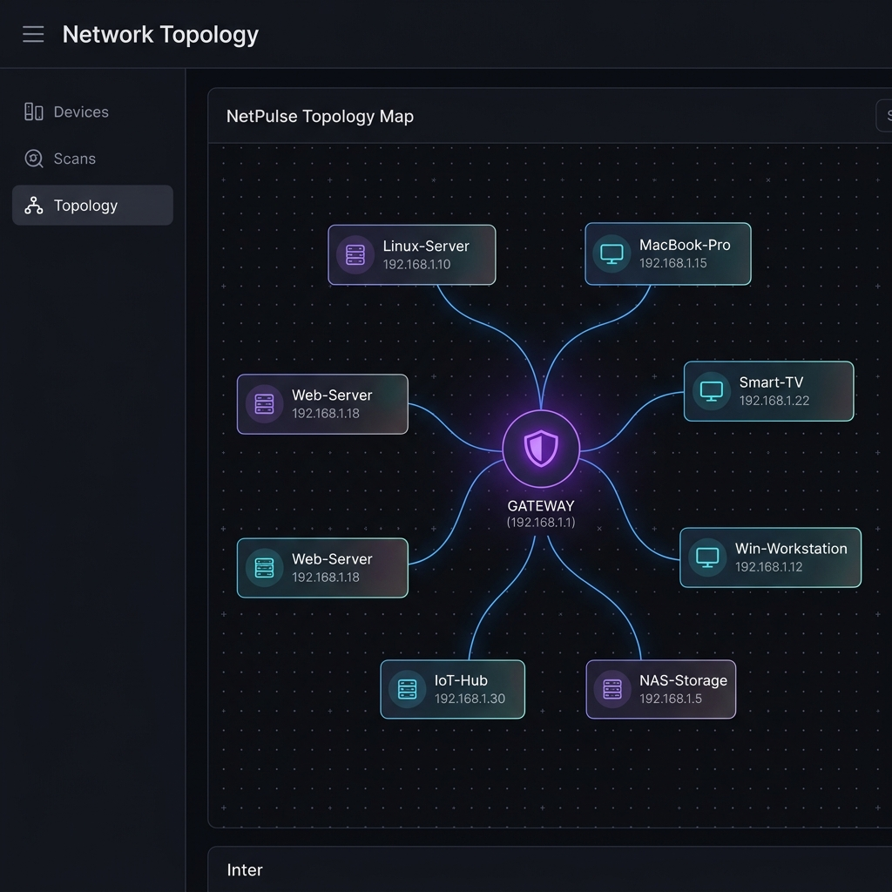
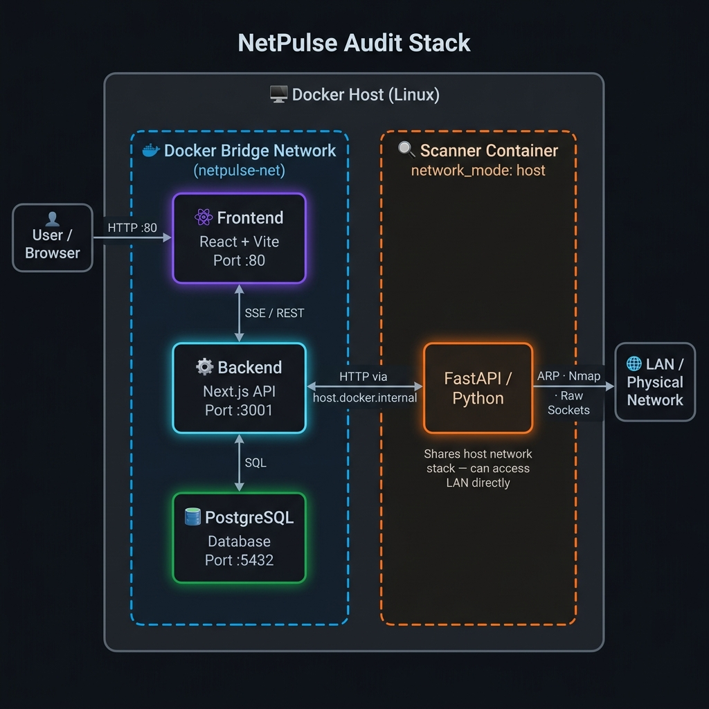

# 📡 NetPulse Audit Stack

Plataforma profesional de descubrimiento de red y auditoría de dispositivos en tiempo real, diseñada bajo una arquitectura de microservicios contenerizada.

## 📸 Preview

### Network Discovery — Dark Mode
> Escanea rangos de red en tiempo real. Los dispositivos aparecen al instante conforme son detectados.


### Scan History — Dark Mode
> Historial completo de escaneos con dispositivos encontrados, timestamps y estado.


### Scan History — Light Mode
> Interfaz adaptable con soporte de tema claro para entornos de trabajo diurnos.


### Network Topology — Interactive Map
> Visualiza la infraestructura de red de forma gráfica. Arrastra nodos, haz zoom y analiza las conexiones entre el Gateway y los dispositivos detectados.



---

## 🏗️ Arquitectura del Sistema



### Componentes:
1.  **Scanner (Python/FastAPI):** El motor táctico. Utiliza `Nmap` con ejecución asíncrona (`asyncio`) y privilegios de red (`host mode`) para el descubrimiento profundo de dispositivos y puertos en toda la subred.
2.  **Backend (Next.js 16+):** El orquestador de APIs. Gestiona la lógica de negocio, las rutas de red y las consultas de alto rendimiento a la base de datos usando SQL puro mediante el driver `pg`.
3.  **Frontend (React/Vite):** El dashboard visual. Una interfaz moderna y reactiva que utiliza **ReactFlow** para la topología y Context API para el estado global.
4.  **Database (PostgreSQL):** Almacenamiento persistente relacional de dispositivos, puertos, y la traza histórica exacta de escaneos.

---

## 🚀 Características Principales

- **Streaming en Vivo:** Resultados instantáneos mediante Server-Sent Events (SSE).
- **Mapa de Topología:** Visualización interactiva de nodos y conexiones (ReactFlow).
- **Historial Relacional:** Traza completa de escaneos y dispositivos en PostgreSQL.
- **Arquitectura de Microservicios:** Separación clara entre Scanner, Backend y Frontend.
- **CI/CD Local:** Validación automatizada de tipos, linting y tests unitarios.

---

## 🛠️ Stack Tecnológico

| Componente | Tecnología |
| :--- | :--- |
| **Scanner** | Docker, Python 3.11, FastAPI, Nmap, asyncio |
| **Backend** | Docker, Node.js, Next.js (App Router API), TypeScript, pg |
| **Frontend** | React 19, Vite, Tailwind CSS v4, **ReactFlow**, Lucide React |
| **Infraestructura** | Docker Compose, Makefile, CI/CD Local (`make ci`) |
| **Base de Datos** | Docker, PostgreSQL 15 (Alpine) |

---

## 🚦 Guía de Inicio Rápido

### Prerrequisitos
- Docker & Docker Compose
- Nmap instalado en el host (opcional, el contenedor lo incluye)
- Permisos de red (el scanner usa `network_mode: host`)

### Instalación
1. Clonar el repositorio:
   ```bash
   git clone https://github.com/JoseAndres20/NetPulse.git
   cd NetPulse
   ```
2. Configurar variables de entorno:
   ```bash
   cp .env.example .env
   # Edita .env con tus credenciales
   ```
3. Levantar los servicios:
   ```bash
   make up
   ```
4. Acceder al dashboard:
   - Frontend: [http://localhost](http://localhost)
   - Backend API: [http://localhost:3001](http://localhost:3001)

### CI/CD Local
Para asegurar la calidad del código antes de un commit, ejecuta:
```bash
make ci
```

---

## 🛡️ Licencia
Distribuido bajo la Licencia MIT. Ver `LICENSE` para más información.
